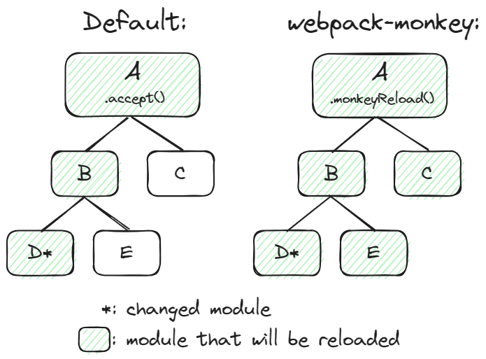

# webpack-monkey

[](https://www.npmjs.com/package/webpack-monkey)
[](https://github.com/guansss/webpack-monkey/actions)

A webpack plugin for developing your userscripts with a modern workflow.

Focusing on support for [Tampermonkey](https://www.tampermonkey.net/) and [Violentmonkey](https://violentmonkey.github.io/).

- [Features](#features)
- [Installation](#installation)
- [Quick start](#quick-start)
  - [1. Set up the project](#1-set-up-the-project)
  - [2. Install the dev script](#2-install-the-dev-script)
  - [3. Start developing](#3-start-developing)
  - [4. Build for release](#4-build-for-release)
  - [Advanced: multiple userscripts](#advanced-multiple-userscripts)
  - [More examples](#more-examples)
- [API / Configuration](#api--configuration)
  - [`monkey(config)`](#monkeyconfig)
  - [`module.hot.monkeyReload(options)`](#modulehotmonkeyreloadoptions)
- [Meta generation](#meta-generation)
- [External dependencies (@require)](#external-dependencies-require)
- [External assets (@resource)](#external-assets-resource)
- [CSS](#css)
- [TypeScript](#typescript)
- [Working with HMR](#working-with-hmr)
- [Comparison with vite-plugin-monkey](#comparison-with-vite-plugin-monkey)
- [Development Notes](DEVELOPMENT.md)

## Features

- **HMR (Hot Module Replacement)**: Easily apply changes without page reload.
- **CSP bypassing**: No worries about CSP restrictions during development.
- **Meta generation**: Generate userscript meta blocks programmatically.
- **Multiple userscripts**: Develop multiple userscripts at the same time.
- **Clean output**: Comply with the userscript hosting sites' no-minification requirement.

The modern workflow also allows:

- **Compiling**: Use the latest JavaScript features and even TypeScript.
- **Code splitting**: Split your code into multiple files, and share code between userscripts.

## Installation

```sh
npm install webpack-monkey

# peer dependencies
npm install webpack webpack-dev-server
```

## Quick start

Here is a preview of the final file structure:

```
.
├── dist
│   └── hello.user.js
├── src
│   ├── index.js
│   └── meta.js
├── webpack.config.js
└── package.json
```

### 1. Set up the project

Create a new project and initialize it with npm:

```sh
npm init -y
npm install webpack webpack-cli webpack-dev-server webpack-monkey
```

Create `src/index.js`:

```js
GM_log("Hello world!")

// enable HMR, for more details please check the HMR section below
if (module.hot) {
  module.hot.monkeyReload()
}
```

Create `src/meta.js`:

```js
module.exports = {
  name: "Hello world",
  version: "1.0.0",
  match: ["*://example.com/"],
}
```

Create `webpack.config.js`:

```js
const path = require("path")
const { monkey } = require("webpack-monkey")

module.exports = monkey({
  entry: {
    hello: "./src/index.js",
  },
  output: {
    path: path.resolve(__dirname, "dist"),
  },
})
```

Finally, add the following scripts to `package.json`:

```json
{
  "scripts": {
    "dev": "webpack serve --mode development",
    "build": "webpack --mode production"
  }
}
```

### 2. Install the dev script

Run `npm run dev`. When the dev server is ready, you should see a message like this:

```
[MonkeyPlugin] Dev script hosted at: http://localhost:xxxx/monkey-dev.user.js
```

Now open the URL in your browser and install the dev script.

> [!IMPORTANT]  
> Unless the dev server's _port_ has changed, you don't need to reinstall the dev script after running `npm run dev` next time.

### 3. Start developing

Go to `http://example.com` and open the console, you should see the message `"Hello world!"`.

Now edit `index.js` and try to change the message text in `GM_log()`, save the file, and you'll see the new message printed in the console without page reload!

### 4. Build for release

Run `npm run build`, and the userscript will be built to `dist/hello.user.js`:

```js
// ==UserScript==
// @name     Hello world
// @grant    GM_log
// @match    *://example.com/
// @version  1.0.0
// ==/UserScript==

;(() => {
  GM_log("Hello, world!")
})()
```

Note that the `GM_log` function is automatically added to `@grant`.

### Advanced: multiple userscripts

Set up your project as follows to develop multiple userscripts at the same time:

```
.
├── dist
│   ├── foo.user.js
│   └── bar.user.js
├── src
│   ├── foo
│   │   ├── index.js
│   │   └── meta.js
│   └── bar
│       ├── index.js
│       └── meta.js
├── webpack.config.js
└── package.json
```

And update `webpack.config.js` as:

```js
const path = require("path")
const { monkey } = require("webpack-monkey")

module.exports = monkey({
  entry: {
    foo: "./src/foo/index.js",
    bar: "./src/bar/index.js",
  },
  output: {
    path: path.resolve(__dirname, "dist"),
  },
})
```

Now you can run `npm run dev` and both userscripts will be served, no need to install the dev scripts again.

### More examples

- This project's [examples](examples)
- This project's [playground](playground)
- My own userscripts repo: [userscripts](https://github.com/guansss/userscripts) (in pure TypeScript)

## API / Configuration

### `monkey(config)`

Takes a webpack config object and returns a cloned config object with plugins added and some options modified.

> [!NOTE]  
> The followings are some major changes to the config, for more details please check [the source code](src/node/monkey.ts).
>
> - Adds some sensible defaults for userscript development.
> - Adds `MonkeyPlugin` to the plugins list.
> - Replaces the default minimizer `TerserPlugin` with `MonkeyMinimizer`, which extends `TerserPlugin` with some extra features.

The monkey options are passed as the `monkey` property of the webpack config object:

```js
module.exports = monkey({
  // normal webpack options
  entry: "./src/index.js",
  output: {
    path: path.resolve(__dirname, "dist"),
  },

  // monkey options
  monkey: {
    debug: true,
  },
})
```

**Options**

- **[`debug`](#debug)**
- **[`meta.resolve`](#metaresolve)**
- **[`meta.load`](#metaload)**
- **[`meta.transform`](#metatransform)**
- **[`require.provider`](#requireprovider)**
- **[`require.lockVersions`](#requirelockversions)**
- **[`require.exportsFromUnnamed`](#requireexportsfromunnamed)**
- **[`require.resolve`](#requireresolve)**
- **[`devScript.meta`](#devscriptmeta)**
- **[`devScript.transform`](#devscripttransform)**
- **[`beautify.prettier`](#beautifyprettier)**
- **[`terserPluginOptions`](#terserpluginoptions)**

You'll find some options that can be a function with a context object as the second argument. The context object has the following type:

```ts
interface OptionFunctionContext {
  logger: WebpackLogger | Console
}
```

#### `debug`

Type: `boolean`\
Default: `false`

When enabled, some debug messages will be printed in the console (just a few for now).

#### `meta.resolve`

Type: `string | string[] | (arg: { entryName: string; entry: string }, context) => string | undefined | Promise<string | undefined>`\
Default: `["meta.js", "meta.ts", "meta.json"]`

The path of meta file to be used by `meta.load` later. If an array, the first file that matches will be used.

You can pass a custom function as the resolver:

```ts
monkey({
  monkey: {
    meta: {
      resolve({ entry }) {
        return path.resolve(path.dirname(entry), "meta.txt")

        // if undefined, this entry will not be treated as a userscript
        // return undefined
      },
    },
  },
})
```

#### `meta.load`

Type: `(arg: { file: string }, context) => UserscriptMeta | Promise<UserscriptMeta>`\
Default: `require()`

Function to load the meta file and return the meta object. The default function uses `require()` to load the meta file with supported extensions: `.js`, `.ts`, `.json`.

```ts
monkey({
  monkey: {
    meta: {
      load({ file }) {
        // read JSON from a meta.txt given by the above meta.resolve example
        return JSON.stringify(fs.readFileSync(file, "utf-8"))
      },
    },
  },
})
```

#### `meta.transform`

Type: `(arg: { meta: UserscriptMeta }, context) => UserscriptMeta | Promise<UserscriptMeta>`\
Default: `undefined`

Function to transform the meta object before using it for serving or building. Can be used to add or modify meta properties.

#### `meta.generateFile`

Type: `boolean`\
Default: `true`

Generating `*.meta.js` for lightweight update checking when self-hosting userscripts, e.g. GitHub Pages

#### `require.provider`

Type: `"jsdelivr" | "unpkg"`\
Default: `"unpkg"`

When [importing modules using webpack externals](#4-webpack-externals-with-global-variable-most-flexible), the module will be resolved to `// @require <CDN>/<moduleName>@<version>`, where `<CDN>` is the provider's URL prefix (for example `https://cdn.jsdelivr.net/npm`), and `<version>` is the version of the installed package, or, if not found, the version range specified in the project's `package.json` (can be controlled with `require.lockVersions`).

#### `require.lockVersions`

Type: `boolean`\
Default: `true`

When using a CDN provider, this option controls whether to generate URLs with the versions of installed packages, or the version ranges specified in the project's `package.json`. For example:

- `false`: `https://unpkg.com/jquery@^3.5.0` (version range specified in `package.json`)
- `true`: `https://unpkg.com/jquery@3.6.0` (version actually installed)

#### `require.exportsFromUnnamed`

Type: `boolean`\
Default: `false`

When importing an external module with URL, whether to allow using its exports without specifying a global variable name for it. For example:

```js
import { ajax } from "https://unpkg.com/jquery"
```

The above code will cause a runtime error because a global variable (`$`) is not specified along with the URL. In this case, webpack-monkey will print a warning in development mode and throw an error in production mode. Setting this option to `true` suppresses the warning and error.

#### `require.resolve`

Type:

```ts
type RequireResolver = (
  arg: {
    name: string // the module name
    externalType: string // you would't need this if you don't know what it is
    version?: string // the installed version, or undefined if not found
    packageVersion?: string // the version specified in package.json, or undefined if not found
    url?: string // the URL if the module is imported with URL, otherwise undefined
  },
  context: object,
) => string | undefined | Promise<string | undefined>
```

Default: `undefined`

Custom resolver for external dependencies. The function should return a URL string, or undefined if the module should not produce a `@require`.

```js
monkey({
  monkey: {
    require: {
      resolve({ name, url }) {
        if (name.includes("dev-tools")) {
          return undefined
        }

        return url || "https://unpkg.com/" + name
      },
    },
  },
})
```

#### `devScript.meta`

Type: `UserscriptMeta | ((arg: { meta: UserscriptMeta }) => UserscriptMeta)`\
Default: `undefined`

Meta object for the dev script. If an object, it will be merged with the default meta object; if a function, it will be called with the default meta object as the argument, and the returned object will be used as a replacement.

#### `devScript.transform`

Type: `(arg: { content: string }, context) => string`\
Default: `undefined`

Function to transform the dev script content before serving. Can be used to add or modify the script content.

#### `beautify.prettier`

Type: `boolean`\
Default: `undefined`

When enabled, the output will be formatted using [Prettier](https://prettier.io/) with your Prettier config. When undefined, it will be enabled if Prettier is found installed.

#### `terserPluginOptions`

Type: `object`\
Default: `undefined`

Custom options for the minimizer [`TerserPlugin`](https://webpack.js.org/plugins/terser-webpack-plugin/).

### `module.hot.monkeyReload(options)`

Works the same as `module.hot.accept()`, except that it'll **reload the whole userscript** instead of the changed module and the modules that depend on it. See [Working with HMR](#working-with-hmr) section for more details.

**Options**

- **[`ignore`](#ignore)**

#### `ignore`

Type: `(string | RegExp)[] | (moduleId: string | number) => boolean`\
Default: `["node_modules"]`

Modules to ignore when reloading. Can be a list of strings or regular expressions, or a function that returns a boolean.

Note that this only affects the modules that webpack-monkey tries to additionally reload, and does not affect the modules that webpack would reload according to its own rules.

## Meta generation

The meta object is provided in a separate file. By default, webpack-monkey will look for `meta.js`, `meta.ts`, or `meta.json` in the same directory as the entry file, and load it with `require()`.

You can customize this behavior with the `monkey.meta.resolve` and `monkey.meta.load` options.

> [!NOTE]
> The meta file is evaluated in the Node.js environment, so you can `require()` other modules in it, and cannot use browser APIs such as `window`.

The meta fields have different types as shown below:

<table>
<thead>
  <tr>
    <th>Type</th>
    <th>Fields</th>
    <th>Example</th>
    <th>Example output</th>
  </tr>
</thead>
<tbody>
  <tr>
    <td>Boolean</td>
    <td><code>noframes</code></td>
<td>

```js
module.exports = {
  noframes: true,
}
```

</td>
<td>

```js
// @noframes
```

</td>
  </tr>
  <tr>
    <td>Array</td>
    <td><code>grant</code><br><code>match</code><br><code>include</code><br><code>exclude</code><br><code>require</code><br><code>resource</code><br><code>connect</code><br><code>webRequest</code><br></td>
<td>

<!-- prettier-ignore -->
```js
module.exports = {
  match: [
    "*://example.com/",
    "*://example.org/"
  ],
  // can be a string if only one item
  require: "https://example.com/foo.js",
  // empty array will be omitted
  resource: [],
}
```

</td>
<td>

```js
// @match   *://example.com/
// @match   *://example.org/
// @require https://example.com/foo.js
```

</td>
  </tr>
  <tr>
    <td>Object<br>(I18n)</td>
    <td><code>name</code><br><code>description</code></td>
<td>

```js
module.exports = {
  name: {
    default: "Hello world",
    "zh-CN": "你好世界",
  },
  // can be a string if only one item
  description: "Say hello to the world!",
}
```

</td>
<td>

```js
// @name        Hello world
// @name:zh-CN  你好世界
// @description Say hello to the world!
```

</td>
  </tr>
  <tr>
    <td>String</td>
    <td>All the others</td>
<td>

```js
module.exports = {
  version: "0.1",
}
```

</td>
<td>

```js
//@version 0.1
```

</td>
  </tr>
</tbody>
</table>

## External dependencies (@require)

There are several ways to handle external dependencies, please choose the one that suits you best.

1. [meta.require (simple)](#1-metarequire-simple)
2. [import with URL (good for tree-shaking)](#2-import-with-url-good-for-tree-shaking)
3. [Webpack externals with URL (good for tree-shaking and TypeScript)](#3-webpack-externals-with-url-good-for-tree-shaking-and-typescript) <- recommended
4. [Webpack externals with global variable (most flexible)](#4-webpack-externals-with-global-variable-most-flexible)

### 1. meta.require (simple)

The simplest way is to put the URL in the `require` meta property:

```js
// meta.js
module.exports = {
  require: [
    "https://unpkg.com/jquery@3.6.0",

    // to load a specific file instead of the default entry, specify its full path
    "https://unpkg.com/lodash@4.17.21/lodash.min.js",
  ],
}

// index.js
$(".foo").text(_.capitalize("hello world"))
```

### 2. import with URL (good for tree-shaking)

You can directly import an external script with URL:

```js
// index.js
import "https://unpkg.com/jquery@3.6.0"

$(".foo")
```

You can also use [other import forms](https://developer.mozilla.org/en-US/docs/Web/JavaScript/Reference/Statements/import#forms_of_import_declarations). When using an import form other than _Side effect import_, the external script will be treated as a module, and you must provide a global variable name to reference the module in the format of `"<globalVar>@<URL>"`, for example:

```js
import jq, { ajax } from "$@https://unpkg.com/jquery@3.6.0"

jq(".foo").click(() => ajax("/api"))
```

The above code is roughly equivalent to the following:

```js
import "https://unpkg.com/jquery@3.6.0"

const jq = $
const { ajax } = $
```

... except that the global variable `$` is treated as a module object, so webpack generates a [shim](https://webpack.js.org/guides/shimming/) for it - not much a thing to worry about though.

Note that you don't need to specify an import name that is different from the global variable name, because webpack will (always) rename it to a longer form. For example, you can write `import $ from "$@..."`, and webpack will generate an output like `const external_$_namespaceObject = $`.

### 3. Webpack externals with URL (good for tree-shaking and TypeScript)

```js
// webpack.config.js
module.exports = {
  externals: {
    // same rule as in [2. import with URL], specify a global variable name if needed
    jquery: "https://unpkg.com/jquery@3.6.0",
    lodash: "_@https://unpkg.com/lodash",
  },
}

// index.js
import "jquery"
import _ from "lodash"
```

### 4. Webpack externals with global variable (most flexible)

```js
// webpack.config.js
module.exports = {
  externals: {
    jquery: "$",
  },
}

// index.js
import "jquery"
// or
import $ from "jquery"
```

In this case, the module will be resolved to a URL according to the [`require`](#require) option. If `require.resolve` is specified, it will be used; otherwise, a CDN provider will be used according to `require.provider`.

## External assets (@resource)

Not well supported yet, coming soon. For now, you can put the asset URLs in the meta object, and manually fetch them during development:

```js
// meta.js
module.exports = {
  resource: ["myText   https://example.com/my-text.txt"],
}

// index.js
async function main() {
  const myText =
    process.env.NODE_ENV === "development"
      ? await fetch("https://example.com/my-text.txt").then((res) => res.text())
      : GM_getResourceText("myText")

  console.log(myText)
}
```

## CSS

You can import CSS files in your js files (check out [webpack's guide](https://webpack.js.org/guides/asset-management/#loading-css)), and webpack-monkey will bundle them into the userscript:

**index.js**

```js
import "./styles.css"

GM_log("Hello world!")
```

**styles.css**

```css
body {
  color: red;
}
```

**dist/hello.user.js**

```js
// ==UserScript==
// @name     Hello world
// @grant    GM_log
// @grant    GM_addStyle
// @match    *://*/*
// @version  1.0.0
// ==/UserScript==

;(() => {
  GM_log("Hello, world!")
})()

GM_addStyle(`
body {
  color: red;
}
`)
```

The CSS content will be wrapped in a `GM_addStyle()` at the end of the userscript, so if you or your users are inspecting the code, you can see the JavaScript code from the beginning, without having to scroll over a massive CSS block.

Bonus: when writing styles for your custom DOM elements, a good practice is to use [CSS Modules](https://github.com/css-modules/css-modules), which ensures that your class names will not conflict with other userscripts or the page itself. Check out [webpack's guide](https://webpack.js.org/loaders/css-loader/#modules).

## TypeScript

TypeScript is supported out of the box. Just set up the TypeScript environment as usual, and you're good to go. Check out [webpack's guide](https://webpack.js.org/guides/typescript/) if you're not familiar with it.

Note that only `ts-loader` and `babel-loader` are tested. Other loaders are supposed to work, otherwise please let me know by opening an issue.

Bonus: install `@types/tampermonkey` to get the types for `GM_*`.

### meta.ts

You can place the meta object in a `meta.ts` as well:

```ts
// note: Meta is an alias of UserscriptMeta
import { Meta } from "webpack-monkey"

export default {
  version: "1.0",
  name: "Hello world",
} satisfies Meta
```

However, since this TypeScript file will be loaded with `require()`, you'll need to set up your environment to support it. Here's an example using [ts-node](https://typestrong.org/ts-node/):

1. Install `ts-node`: `npm install ts-node`
2. In your `tsconfig.json`, set `esModuleInterop: true` and add a `ts-node` object that sets `module: "commonjs"`:

   ```json
   {
     "compilerOptions": {
       "esModuleInterop": true
     },

     "ts-node": {
       "compilerOptions": {
         "module": "commonjs"
       }
     }
   }
   ```

3. Do either of the following:

   - Rename `webpack.config.js` to `webpack.config.ts` (maybe need some rewriting), then webpack will do the rest for you.
   - Install `cross-env`. Then in your `package.json`, prepend a [node flag](https://typestrong.org/ts-node/docs/usage/#node-flags-and-other-tools) to the webpack commands:

     ```diff
       {
         "scripts": {
     -     "dev": "webpack serve --mode development",
     -     "build": "webpack --mode production"
     +     "dev": "cross-env NODE_OPTIONS=\"-r ts-node/register --no-warnings\" webpack serve --mode development",
     +     "build": "cross-env NODE_OPTIONS=\"-r ts-node/register --no-warnings\" webpack --mode production"
         }
       }
     ```

### meta.js with JSDoc

If you find the above method too complicated, you can also use a `meta.js` with JSDoc comments:

```js
/**
 * @type {import("webpack-monkey").Meta}
 */
const meta = {
  name: "Hello world",
  version: "1.0.0",
}

module.exports = meta
```

If you're using WebStorm, the JSDoc type checking seems to be supported out of the box so you're good to go.

If you're using VSCode, some [extra steps](https://code.visualstudio.com/docs/nodejs/working-with-javascript#_type-checking-javascript) are needed.

### Typing external dependencies

To type an external dependency, you are most likely to locally install it (`npm install xxx`), or if the types are not built-in, install only its types package (`@types/xxx`).

Then, if using the #3 or #4 method of [handling external dependencies](#external-dependencies-require), TypeScript will automatically recognize the types when imported:

```ts
import $ from "jquery"
```

And if using #1 or #2, you need to manually declare the global variables:

```ts
/// <reference types="jquery" />

declare global {
  var $: JQueryStatic

  // you can also use an inline import
  var mitt: typeof import("mitt").default
}

$(".foo")
mitt()
```

## Working with HMR

If you don't know what HMR is, check out [webpack's introduction](https://webpack.js.org/concepts/hot-module-replacement/).

### TL;DR

webpack-monkey extends webpack's HMR API with `module.hot.monkeyReload()` to reload all the modules in a userscript when any of them is changed.

`module.hot.monkeyReload()` should be added to each userscript's **entry file**, and then you can clear side effects with `module.hot.dispose()` in any dependent modules. Example:

**index.js**

```js
import { foo } from "./foo"

const element = $("<div>").text(foo).appendTo("body")

if (module.hot) {
  module.hot.monkeyReload()
  module.hot.dispose(() => {
    element.remove()
  })
}
```

**foo.js**

```js
import { bar } from "./bar"

export const foo = "foo"

bar()
```

**bar.js**

```js
export function bar() {
  const timer = setInterval(() => console.log(Date.now()), 1000)

  if (module.hot) {
    module.hot.dispose(() => {
      clearInterval(timer)
    })
  }
}
```

### Why HMR?

When developing userscripts, you'll most likely want to enable HMR to prevent page reloads, because you have no direct access to the target page's states and will lose them all when reloading, for example the position in an infinite scroll list, which is very annoying and slows down the development.

### webpack's standard method

You've probably already used some frameworks such as React and Vue that have the HMR support built in for you, and it's pretty straightforward to change your _components' code_ and see the changes applied without page reload. However, if you change the _code outside of components_, a full page reload is performed because webpack cannot magically clear the outdated code's (possible) side effects.

So how to prevent full reloads without such frameworks? Webpack has a [HMR guide](https://webpack.js.org/guides/hot-module-replacement/) for the standard method, but it's too complicated to understand, and too hard to set up without making mistakes.

Let's take the example from that guide to start with:

```js
import _ from "lodash"
import printMe from "./print.js"

function component() {
  // ...

  return element
}

let element = component() // Store the element to re-render on print.js changes
document.body.appendChild(element)

if (module.hot) {
  module.hot.accept("./print.js", function () {
    console.log("Accepting the updated printMe module!")
    document.body.removeChild(element)
    element = component() // Re-render the "component" to update the click handler
    document.body.appendChild(element)
  })
}
```

This works, but accepting dependencies is super tedious and error-prone, because you have to figure out each dependency's side effects and the way to clear them, and you have to write each dependency's path without the help of IDE's auto-completion and auto-renaming, which is a nightmare for maintenance.

So a better way is to self-accept the current module and only clear itself's side effects:

```diff
  if (module.hot) {
-   module.hot.accept("./print.js", function () {
-     console.log("Accepting the updated printMe module!")
-     document.body.removeChild(element)
-     element = component() // Re-render the "component" to update the click handler
-     document.body.appendChild(element)
-   })
+   module.hot.accept()
+   module.hot.dispose(() => {
+     document.body.removeChild(element)
+   })
  }
```

But some other problems arise. Let's take another example:

**index.js**

```js
import { onResize } from "./helper"

onResize(() => console.log("resized"))

if (module.hot) {
  module.hot.accept()
}
```

**helper.js**

```js
export function onResize(listener) {
  window.addEventListener("resize", listener)
}
```

How to clear this side effect? It happens inside `helper.js`, but we cannot clear it with a `.dispose()` there, because if `index.js` is updated, then `helper.js` will not be reloaded, and its `.dispose()` will not be called. So we need to hoist this responsibility onto `index.js`:

**index.js**

```diff
  import { onResize } from "./helper"

- onResize(() => console.log("resized"))
+ const offResize = onResize(() => console.log("resized"))

  if (module.hot) {
    module.hot.accept()
+   module.hot.dispose(() => {
+     offResize()
+   })
  }
```

**helper.js**

```diff
  export function onResize(listener) {
    window.addEventListener("resize", listener)

+   return () => {
+     window.removeEventListener("resize", listener)
+   }
  }
```

This is still quite annoying:

1. When building for release, the `return () => ...` part is unused, but still bundled into the production code, making the size unnecessarily large.
2. If `onResize()` is called multiple times, we'll have to keep track of all the returned functions and call them all in `.dispose()`.
3. If we want `onResize()` to return something else, we'll have to make other dirty workarounds.

### webpack-monkey's method

webpack-monkey provides a simple solution for this by extending webpack's HMR API. You only need to put these few lines in your userscript's **entry file**:

```js
if (module.hot) {
  module.hot.monkeyReload()
}
```

`module.hot.monkeyReload()` works the same as `module.hot.accept()` except that it'll **reload the whole userscript** instead of the changed module and the modules that depend on it, as shown below:



This means you no longer have to worry about the relationship between modules, you only focus on clearing the side effects for each individual module.

With this feature, we can rewrite the above example as:

**index.js**

```diff
  import { onResize } from "./helper"

- const offResize = onResize(() => console.log("resized"))
+ onResize(() => console.log("resized"))

  if (module.hot) {
-   module.hot.accept()
-   module.hot.dispose(() => {
-     offResize()
-   })
+   module.hot.monkeyReload()
  }
```

**helper.js**

```diff
  export function onResize(listener) {
    window.addEventListener("resize", listener)

-   return () => {
-     window.removeEventListener("resize", listener)
-   }
+   if (module.hot) {
+     module.hot.dispose(() => {
+       window.removeEventListener("resize", listener)
+     })
+   }
  }
```

Now `helper.js` will be reloaded when `index.js` is updated, so we can place the cleanup code immediately after the side effect code, which is very intuitive and easy to maintain.

The `if (module.hot)` block will also be removed when building for release, so no more unused code.

## Comparison with vite-plugin-monkey

[vite-plugin-monkey](https://github.com/lisonge/vite-plugin-monkey) is another great plugin for developing userscripts but with Vite. This plugin and webpack-monkey basically share the same goal - to develop userscripts with bundling and HMR support, but they have different approaches.

### Vite vs. webpack

Vite is a next-generation build tool and is faster than webpack. However, Vite has a limitation that it only emits ES modules in development mode, meaning that they must be loaded with `<script type="module">`, which will be blocked by the page's CSP if it has one. A notable example of CSP-enabled sites is `github.com`.

There is a workaround though - you can disable CSP with a browser extension. But it's a risky move because CSP is a security feature and is there for a reason, also you may forget to re-enable it after development. More importantly, if you are maintaining an open-source userscript, your contributors will be required to disable CSP as well, which is not a good experience.

Webpack, on the other hand, emits CommonJS modules in development mode, which are capable to be evaluated in userscript scope and will never be affected by CSP.

### Plugin differences

vite-plugin-monkey is quite a mature project and has been well tested by the community. It has some features that webpack-monkey doesn't have yet, such as:

- Loading external assets (@resource)
- Greasemonkey support (GM.\*)

webpack-monkey is still in early development but has some exclusive features:

- CSP bypassing
- Developing multiple userscripts by installing a single dev script
- Reloading userscripts instead of the page when performing HMR with side effects

### Is webpack-monkey a plagiarism?

I have to put this here because I guess this kind of thought can easily come to one's mind.

The answer is no. They have many similar concepts and features, but these are some features that a decent userscript development tool _should_ have. It's like all planets are round.

In fact, a bit earlier than vite-plugin-monkey, I once spent a lot of time using Vite to set up a development environment for my own [userscripts](https://github.com/guansss/userscripts), which was somewhat inspired by [rollup-userscript-template](https://github.com/cvzi/rollup-userscript-template). It worked well until I found the CSP issue when developing a userscript for GitHub, and I was very frustrated because there's no choice but to disable CSP. So I migrated the framework to webpack and eventually decided to extract the code as a plugin.

Okay but, is the name a plagiarism? I don't think so. I was thinking about _webpack-userscript_, but apparently it's already taken by another plugin (with quite different features so I'm not writing a comparison here). Then I came up with _webpack-monkey_, and then searched for name conflicts and discovered vite-plugin-monkey. I was a bit surprised but I think it's just a coincidence and decided to keep the name as it sounds good. I don't like monkeys though. I like cats.
